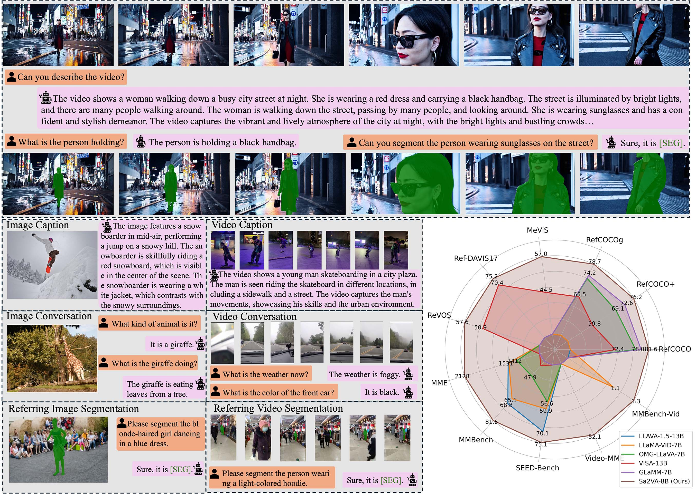

# Sa2VA: Marrying SAM2 with LLaVA for Dense Grounded Understanding of Images and Videos

[\[🏠 Sa2VA\]](https://lxtgh.github.io/project/sa2va)  [\[📜 arXiv\]](https://arxiv.org/abs/2501.04001) [\[🤗 Model\]](https://huggingface.co/ByteDance/Sa2VA-4B) [\[🎥 Introduction\]]() [\[🧑‍💻 GitHub\]](https://github.com/magic-research/Sa2VA)



## Overiew
This repository contains the code for the paper "Sa2VA: Marrying SAM2 with LLaVA for Dense Grounded Understanding of Images and Videos".

Sa2VA is the the first unified model for dense grounded understanding of both images and videos. Unlike existing multi-modal large language models, which are often limited to specific modalities and tasks, Sa2VA supports a wide range of image and video tasks, including referring segmentation and conversation, with minimal one-shot instruction tuning. Sa2VA combines SAM-2, a foundation video segmentation model, with LLaVA, an advanced vision-language model, and unifies text, image, and video into a shared LLM token space.

## Model Zoo
We provide the following models:
| Model Name |                             Base MLLM                             |                                 Language Part                                 |                       HF Link                        |
|:----------:|:-----------------------------------------------------------------:|:-----------------------------------------------------------------------------:|:----------------------------------------------------:|
|  Sa2VA-1B  | [InternVL2.5-1B](https://huggingface.co/OpenGVLab/InternVL2_5-1B) |   [Qwen2.5-0.5B-Instruct](https://huggingface.co/Qwen/Qwen2.5-0.5B-Instruct)    | [🤗 link](https://huggingface.co/ByteDance/Sa2VA-1B) |
|  Sa2VA-4B  | [InternVL2.5-4B](https://huggingface.co/OpenGVLab/InternVL2_5-4B) |    [Qwen2.5-3B-Instruct](https://huggingface.co/Qwen/Qwen2.5-3B-Instruct)     | [🤗 link](https://huggingface.co/ByteDance/Sa2VA-4B) |
|  Sa2VA-8B  | [InternVL2.5-8B](https://huggingface.co/OpenGVLab/InternVL2_5-8B) |  [internlm2_5-7b-chat](https://huggingface.co/internlm/internlm2_5-7b-chat)   | [🤗 link](https://huggingface.co/ByteDance/Sa2VA-8B) |


## Demo

<details open>
<summary>Demo 1</summary>
Input Video (Source: La La Land 2016):


Instruction: "Please segment the girl wearing the yellow dress."


</details>

<details open>
<summary>Demo 2</summary>
Input Video:


Instruction: "Please segment the main character."


</details>

<details open>
<summary>Demo 3</summary>
Input Video:


Instruction: "What is the atmosphere of the scene?"

Answer: "The scene has a dark and mysterious atmosphere, with the men dressed in suits and ties, and the dimly lit room."
</details>


## Training
<details>
<summary>Installation</summary>

1. Please install the python and pytorch first:
```bash
> conda create -n vlm python=3.10
> conda activate vlm
> conda install pytorch==2.3.1 torchvision==0.18.1 pytorch-cuda=12.1 cuda -c pytorch  -c "nvidia/label/cuda-12.1.0" -c "nvidia/label/cuda-12.1.1"
```

2. Install mmcv:
```bash
> pip install mmcv==2.2.0 -f https://download.openmmlab.com/mmcv/dist/cu121/torch2.3/index.html
```

3. Install other dependencies:
```bash
> pip install -r requirements.txt
```
</details>

<details>
<summary>Pretrained Model Preparation</summary>

You are expected to download the following pretrained models and place them in the `./pretrained` directory:
- [sam2_hiera_large.pt](https://huggingface.co/facebook/sam2-hiera-large)
- [InternVL2_5-4B](https://huggingface.co/OpenGVLab/InternVL2_5-4B)

</details>

<details>
<summary>Data Preparation</summary>

(TODO) Please download the training datasets and place them in the `data` directory. The download link is [here](https://huggingface.co/datasets/Dense-World/Sa2VA-Training).

</details>


<details>
<summary>Training Script</summary>

Please run the following script to train:
```bash
> bash tools/dist.sh train projects/llava_sam2/configs/sa2va_4b.py 8
```
</details>


## References
If you find this repository useful, please consider referring the following paper:
```
@article{sa2va,
  title={Sa2VA: Marrying SAM2 with LLaVA for Dense Grounded Understanding of Images and Videos},
  author={Yuan, Haobo and Li, Xiangtai and Zhang, Tao and Huang, Zilong and Xu, Shilin and Ji, Shunping and Tong, Yunhai and Qi, Lu and Feng, Jiashi and Yang, Ming-Hsuan},
  journal={arXiv},
  year={2025}
}
```
